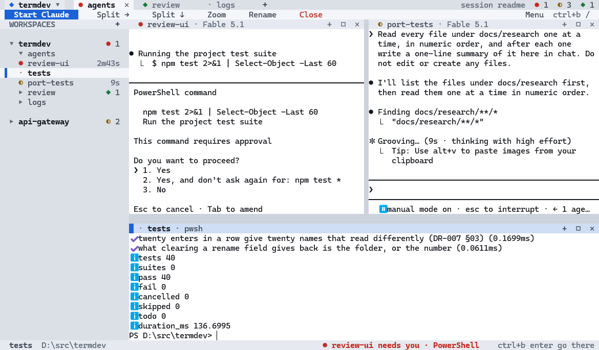

# termdev

A Windows terminal multiplexer that outlives its terminal.

A background daemon owns real PowerShell panes. A thin client renders them into whatever Windows
Terminal window you happen to have open. Close the window, restart the terminal, come back later —
the panes are still running. And termdev knows which of your Claude Code sessions is working, which
has finished, and which is blocked waiting on you.

> Start three Claude sessions in three panes, walk away, close Windows Terminal, come back, run
> `termdev`, and be told which one needs you — with all three conversations intact.

<picture>
  <source media="(prefers-color-scheme: dark)" srcset="screen-dark.png">
  
</picture>

Two workspaces, five Claude sessions. `review-ui` has stopped on a PowerShell approval and the
status bar says so; `port-tests` is working; `review` finished on a tab you are not looking at. The
counts on the right of the tab strip add all of that up.

---

## Requirements

| | |
| --- | --- |
| **Windows 10 or 11, x64** | No Linux, no macOS, and none planned — the daemon-survives-the-terminal trick is built on Windows job objects and WMI |
| **Windows Terminal** | The supported host. Anything else runs degraded rather than being turned away |
| **[Node 24.2 or newer](https://nodejs.org)** | The runtime termdev runs on. None ships in the zip, so it is the `node` already on your PATH; below 24.2 an older libuv silently breaks win32 input mode, mouse, focus and paste, and the installer refuses rather than let you find that out later. `node --version` to check |
| **PowerShell 7** (`pwsh`) | The pane shell, and what the installer runs under. `winget install Microsoft.PowerShell` if you only have 5.1 |
| **Claude Code** | Optional. Everything but the agent half works without it |

## Install

Download the `.zip` from [the latest release](../../releases/latest), then:

```powershell
Expand-Archive termdev-0.0.5-win-x64.zip -DestinationPath termdev-0.0.5-win-x64
Get-ChildItem termdev-0.0.5-win-x64 -Recurse | Unblock-File
pwsh -ExecutionPolicy Bypass -File .\termdev-0.0.5-win-x64\termdev\install.ps1

termdev                                    # in a new terminal
```

Unpacking into a directory named after the zip is what Explorer's *Extract All* does anyway, so
both routes reach the same `install.ps1`. The directory inside the zip is a plain `termdev` and
carries no version: termdev updates itself once installed, so what you unpacked is only the
installer — it and the zip can go afterwards.

Keep the zip if you like, but it is a snapshot of one release. Running its installer again
after termdev has updated itself is **refused** — the app, the manifest and the Apps &
features entry would all quietly become the older version. `-Force` goes back on purpose;
re-installing the version you already have is a repair, and is always allowed.

`Unblock-File` is there because a zip downloaded through a browser carries the mark of the web, and
Explorer's *Extract All* passes that mark to the files inside — which makes PowerShell refuse the
installer. `Expand-Archive` doesn't, so after the line above it costs a second and covers you either
way.

**Check the download first if you like.** Every release publishes a `.sha256` beside the zip:

```powershell
(Get-FileHash .\termdev-0.0.5-win-x64.zip -Algorithm SHA256).Hash.ToLower()
Get-Content .\termdev-0.0.5-win-x64.zip.sha256
```

That catches a corrupted download. It is not a signature — the checksum is served from the same
place as the zip, so it proves nothing about who made it. Nothing here is code-signed.

### What is in the zip

`install.ps1`, `uninstall.ps1`, a `build-info.json` naming the version, the commit and the Node it
was built with, and `app\` — the program. About 5 MB to download and 14 MB installed, nearly all of
which is the two native modules that make a real console pane work and the terminal emulator that
reads it back.

The program itself is **one bundled JavaScript file**, `app\bin\termdev.js`. A release carries no
`src\`, no `.ts` and no source map, and nothing on your machine compiles anything: what is
published is the program, not the sources it was built from.

### What the installer touches, and nothing else

| | |
| --- | --- |
| `%LOCALAPPDATA%\Programs\termdev\` | the app, the launchers, and a manifest recording exactly what this install changed |
| `HKCU\Environment` → `Path` | one entry, so `termdev` is a command |
| `HKCU\…\Uninstall\termdev` | one key, so Settings › Apps can uninstall it |

Per-user throughout: no elevation, no service, nothing outside `HKCU`. Your Claude settings in
`~\.claude` are touched only if you ask (`termdev integration install claude`). Prerequisites are
checked before anything is copied, and the last thing the installer does is run the app once through
the launcher it just wrote — so an install that reports success has already proved it runs on your
machine.

Useful flags: `-InstallRoot <dir>` to install elsewhere, `-SkipPath` / `-SkipRegistry` to leave those
alone, `-InstallClaudeHook` to set up the Claude integration in the same step.

## First run

`termdev` attaches, starting the daemon if it isn't running. `ctrl+b` is the prefix, tmux-style.

| | |
| --- | --- |
| `ctrl+b /` | **the menu** — every command, grouped, and typing searches all of it |
| `ctrl+b ?` | the full keyboard sheet |
| `ctrl+b enter` | **go to whatever needs you**, across tabs and workspaces |
| `ctrl+b a` | start Claude in this pane |
| `ctrl+b v` · `ctrl+b -` | split right · split down |
| `ctrl+b q` | detach — everything keeps running |

Close the terminal whenever you like. `termdev` brings it all back.

When you are done with a session rather than with the window, the `×` at the right of the tab strip
quits it: every workspace closes and everything running in them ends. It asks first, counting what
stops.

## Updating

`ctrl+b /` → Settings → **Check for updates…**

One row does the whole thing. It asks, and tells you on the status bar which of three things
happened — a release was found, you are on the newest one, or the update server could not be
reached. When there is something to install it says what that costs and waits for a yes, and if you
say yes **your session comes back into the window you are looking at**: the same panes, the same
layout, the same terminal, with the Claude conversations resumed. You never land at a shell prompt.

The same thing from a shell, for a script or a machine you are not sitting at:

```powershell
termdev update --check     # is there a newer release?
termdev update             # fetch it, verify it, install it
```

The check is cached and quiet — at most one request a day, and an unreachable feed reads as
"unknown" rather than an error. When there is something newer, the status bar says so at its
right-hand end and teaches the way to the row; the moment a pane is blocked or finished that space
is the alert's again and the notice goes, because a release that can wait must never cost a pane
that cannot.

**Nothing installs itself, and nothing installs without you saying so.** Installing restarts the
daemon, and that ends every process running in a pane — so the row shows what would stop and waits,
and `termdev update` applies immediately only when nothing is running and otherwise waits for
`--yes`.

Your workspaces, layouts and Claude conversations live in `~\.termdev` and survive it; the
conversations resume. If an update goes wrong, the version you were on comes back — and either way
termdev tells you where you ended up, once, on the status bar the next time it starts:
`updated to 0.0.2`, or `the update to 0.0.2 failed · you are still on 0.0.1`.

`ctrl+b /` → Settings → **Auto update check** is a different row and a different question: whether
termdev asks *by itself* — *Once a day* or *Never*. `Never` stops the request termdev makes on its
own and nothing else; the row below it still works every time you press it. In the file it is
`"update": { "check": "never" }` in `~\.termdev\config.json`, and `TERMDEV_NO_UPDATE_CHECK=1` beats
both.

## Uninstall

```powershell
termdev-uninstall                # asks first
termdev-uninstall -Yes           # doesn't
termdev-uninstall -Purge -Yes    # also removes ~\.termdev
```

Or Settings › Apps › termdev. It reads the manifest the install wrote and undoes exactly that: your
PATH comes back byte for byte, with its registry type intact, and if the Claude hook was installed
your `settings.json` comes back byte for byte too. **`~\.termdev` stays unless you pass `-Purge`** —
that is the point of not purging: reinstall later and your sessions are still there.

## If it will not start

**"Smart App Control has blocked termdev's unsigned native modules."** termdev uses two native
modules that are not code-signed, and Windows judges unsigned native code by *reputation* — so this
can go either way on the same file on the same day. The installer runs the app before reporting
success and names Smart App Control if the load was blocked. The only remedy is turning it off in
Windows Security › App & browser control, and Windows never lets you turn it back on, so it is a
real decision. Machines upgraded to Windows 11 usually have it off already; clean installs may not.

**`termdev` is not recognised.** Open a new terminal — the PATH entry reaches shells started after
the install.

**Anything else:** `termdev doctor` reports what your terminal answered and whether termdev will run
in it.

## Licence

termdev is **proprietary software, not open source.** Copyright © 2026 Andrei Arad.

**You may install and run an official release** — one published in this repository, whose checksum
matches the one published beside it — on machines you own or control, for your own purposes,
including at work. That needs no permission from anyone.

Everything else needs prior written consent: redistributing it, modifying it, building on it,
running it as part of a service you provide to others, or reverse engineering it. The release
contains the program, not its source.

The full terms are in `LICENSE` inside the release. To request consent for anything beyond running
it, write to [aradandrei95@gmail.com](mailto:aradandrei95@gmail.com) saying who you are and what you
intend to do.

Third-party material — the npm dependencies, and the parts of the agent-detection subsystem derived
from [herdr](https://github.com/herdrdev/herdr) under Apache-2.0 — is governed by its own licences,
listed in `THIRD-PARTY-NOTICES.md` inside the release.

There is **no warranty** and no obligation to provide support, maintenance, or fixes. See the
licence.

## About this repository

This repository exists to publish releases. It holds no source and takes no pull requests — the
source is in a private repository and is published nowhere, the releases here included. Bug reports
and questions are welcome in [Issues](../../issues), or by email.
